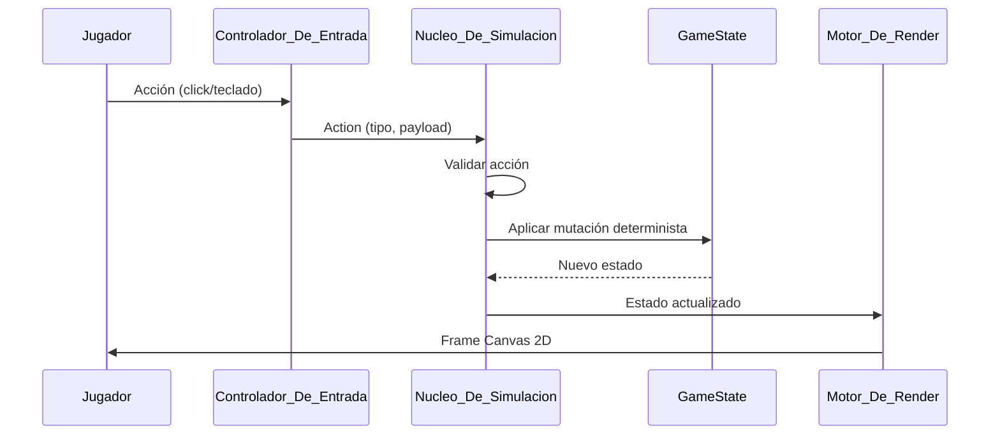
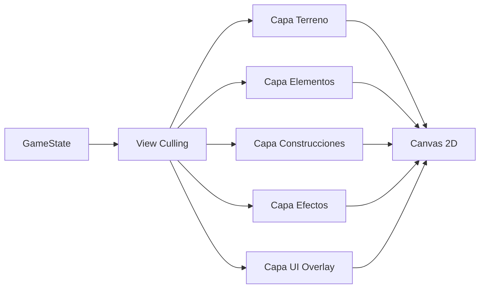

# Documento de Diseño Técnico — Hextown Base Game

## Visión General

Hextown es un juego de estrategia por turnos sobre un mapa hexagonal procedural. Este documento describe la arquitectura técnica, los modelos de datos, los algoritmos principales y la estrategia de testing para la implementación de la Fase 1 del juego base.

### Decisiones de diseño principales

| Decisión | Justificación |
|---|---|
| Simulación determinista desde semilla | Reproducibilidad, compartir mapas, property-based testing |
| Módulos puros sin efectos secundarios | Testabilidad, separación render/lógica |
| Datos externalizados en YAML | Modificar balance sin recompilar |
| Canvas 2D con pixel art generado | Sin dependencias de arte externo ni motores |
| Estado inmutable + acciones | Facilita undo, guardado, replay y testing |
| Coordenadas axiales (q, r) pointy-top | Estándar eficiente para cálculos hexagonales |


## Arquitectura

### Diagrama de sistema

```mermaid
graph TB
    subgraph Capa de Presentación
        UI[Sistema_De_Interfaz]
        Render[Motor_De_Render]
        Input[Controlador_De_Entrada]
    end

    subgraph Capa de Lógica de Juego
        Core[Nucleo_De_Simulacion]
        Clock[Reloj_De_Juego]
        MapGen[Generador_De_Mapa]
        Vis[Gestor_De_Visibilidad]
        Explore[Sistema_De_Exploracion]
        Resources[Gestor_De_Recursos]
        Build[Sistema_De_Construccion]
        Levels[Sistema_De_Niveles]
        Exploit[Sistema_De_Explotacion]
        Factory[Sistema_De_Fabricas]
        Research[Sistema_De_Investigacion]
        Threats[Sistema_De_Amenazas]
        Combat[Resolutor_De_Combate]
        Defense[Sistema_De_Defensa]
        Objectives[Sistema_De_Objetivos]
        Puzzles[Sistema_De_Puzzles]
    end

    subgraph Capa de Datos
        Loader[Cargador_De_Datos]
        Validator[Validador_De_Datos]
        Serializer[Serializador_De_Datos]
        Persistence[Sistema_De_Persistencia]
        Texts[Gestor_De_Textos]
        Events[Registro_De_Eventos]
    end

    Input --> Core
    UI --> Core
    Core --> Clock
    Core --> Resources
    Core --> Vis
    Core --> Explore
    Core --> Build
    Core --> Research
    Core --> Threats
    Core --> Combat
    Core --> Objectives
    Core --> Puzzles
    Core --> Factory
    Render --> UI
    Core --> Render
    Persistence --> Core
    Loader --> Validator
    Loader --> Core
    Texts --> UI
```



### Flujo de datos principal



### Principios arquitectónicos

1. **Estado centralizado**: Todo el estado de la partida vive en un único objeto `GameState` inmutable. Cada acción produce un nuevo estado.
2. **Simulación pura**: El `Nucleo_De_Simulacion` es una función `(GameState, Action) → GameState` sin efectos secundarios.
3. **Determinismo total**: Dado un estado inicial y una secuencia de acciones, el resultado es siempre idéntico. El RNG usa la semilla de la partida.
4. **Datos como configuración**: Los ficheros YAML definen todo el contenido. El código es genérico.
5. **Render desacoplado**: El Motor_De_Render lee el estado pero nunca lo modifica. El loop de render es independiente del tick de simulación.

## Componentes e Interfaces

### Nucleo_De_Simulacion

Punto de entrada de toda mutación del estado. Recibe acciones del jugador y ticks del reloj, las valida y las despacha al subsistema correspondiente.

```typescript
interface SimulationCore {
  dispatch(state: GameState, action: Action): GameState;
  resolveEndOfDay(state: GameState): GameState;
  resolveInstant(state: GameState, instant: GameInstant): GameState;
}
```

### Reloj_De_Juego

Gestiona el avance del tiempo real → tiempo de juego y programa acciones.

```typescript
interface GameClock {
  tick(state: GameState, deltaMs: number): GameState;
  scheduleAction(state: GameState, action: ScheduledAction): GameState;
  skipToNextEvent(state: GameState): GameState;
}

type ClockState = 'stopped' | 'play' | 'fast';
```

### Generador_De_Mapa

Función pura que dada una semilla y un escenario produce un mapa completo.

```typescript
interface MapGenerator {
  generate(scenario: ScenarioData, seed: number): GenerationResult;
}

type GenerationResult =
  | { ok: true; map: HexMap }
  | { ok: false; reason: 'max_attempts'; attempts: number; lastViolations: string[] }
  | { ok: false; reason: 'unknown_constraint'; key: string };
```

### Gestor_De_Visibilidad

Mantiene y transiciona los estados de visibilidad de cada hex.

```typescript
interface VisibilityManager {
  getState(hex: AxialCoord): VisibilityState;
  revealHex(state: GameState, hex: AxialCoord): GameState;
  attenuateNeighbors(state: GameState, hex: AxialCoord): GameState;
}
```

### Gestor_De_Recursos

Aplica costes, producción y validaciones de suficiencia.

```typescript
interface ResourceManager {
  canAfford(state: GameState, cost: ResourceCost): boolean;
  applyCost(state: GameState, cost: ResourceCost, type: 'consume' | 'employ'): GameState;
  applyProduction(state: GameState): GameState;
  applyFamine(state: GameState): GameState;
}
```

### Resolutor_De_Combate

Calcula probabilidades y resuelve combates de forma determinista usando el RNG de la partida.

```typescript
interface CombatResolver {
  calculateProbability(playerForce: number, threatForce: number, diceSize: number): number;
  resolve(state: GameState, hex: AxialCoord): CombatResult;
}
```

### Sistema_De_Construccion / Sistema_De_Niveles

Valida y ejecuta construcción, mejora y demolición.

```typescript
interface ConstructionSystem {
  canBuild(state: GameState, hex: AxialCoord, constructionId: string): ValidationResult;
  build(state: GameState, hex: AxialCoord, constructionId: string): GameState;
  canUpgrade(state: GameState, hex: AxialCoord): ValidationResult;
  upgrade(state: GameState, hex: AxialCoord): GameState;
  canDemolish(state: GameState, hex: AxialCoord): ValidationResult;
  demolish(state: GameState, hex: AxialCoord): GameState;
  cancelUpgrade(state: GameState, hex: AxialCoord): GameState;
}
```

### Sistema_De_Investigacion

Gestiona el árbol de tecnologías y la investigación en curso.

```typescript
interface ResearchSystem {
  canResearch(state: GameState, techId: string): ValidationResult;
  startResearch(state: GameState, techId: string): GameState;
  completeResearch(state: GameState): GameState;
  cancelResearch(state: GameState): GameState;
  getAvailableTechs(state: GameState): TechnologyData[];
}
```

### Sistema_De_Amenazas

Gestiona efectos pasivos, reaparición, expansión y subida de nivel.

```typescript
interface ThreatSystem {
  applyPassiveEffects(state: GameState): GameState;
  resolveRespawns(state: GameState): GameState;
  resolveExpansions(state: GameState): GameState;
  resolveLevelUps(state: GameState): GameState;
}
```

### Sistema_De_Puzzles

Instancia y resuelve puzzles.

```typescript
interface PuzzleSystem {
  instantiate(scenario: ScenarioData, seed: number): PuzzleAssignment[];
  resolve(state: GameState, puzzleId: string, chosenOption: number): GameState;
  getShuffledOptions(puzzleId: string, seed: number): PuzzleOption[];
}
```

### Cargador_De_Datos / Validador_De_Datos

```typescript
interface DataLoader {
  loadAll(yamlSources: string[]): LoadResult;
}

interface DataValidator {
  validate(data: GameData): ValidationReport;
}

type ValidationReport = {
  errors: ValidationError[];
  warnings: ValidationWarning[];
  isBlocking: boolean;
};
```

### Sistema_De_Persistencia

```typescript
interface PersistenceSystem {
  save(state: GameState, slot: string): SaveResult;
  load(slot: string, gameData: GameData): LoadResult;
  autoSave(state: GameState): SaveResult;
}
```

## Modelos de Datos

### Coordenadas Hexagonales

```typescript
/** Coordenada axial pointy-top. La tercera coordenada s = -q - r es implícita. */
interface AxialCoord {
  q: number;
  r: number;
}

/** Distancia hexagonal entre dos celdas */
function hexDistance(a: AxialCoord, b: AxialCoord): number {
  return (Math.abs(a.q - b.q) + Math.abs(a.q + a.r - b.q - b.r) + Math.abs(a.r - b.r)) / 2;
}

/** Vecinos de un hex pointy-top en orden: E, NE, NW, W, SW, SE */
const DIRECTIONS: AxialCoord[] = [
  { q: 1, r: 0 }, { q: 1, r: -1 }, { q: 0, r: -1 },
  { q: -1, r: 0 }, { q: -1, r: 1 }, { q: 0, r: 1 },
];
```

### Estado del Mapa

```typescript
type TerrainType = 'prado' | 'tundra' | 'desierto' | 'no_fertil' | 'oceano';

type VisibilityState = 'hidden' | 'dimmed' | 'explored';

interface HexCell {
  coord: AxialCoord;
  terrain: TerrainType;
  element: MapElement | null;
  construction: Construction | null;
  visibility: VisibilityState;
}

interface HexMap {
  radius: number;
  cells: Map<string, HexCell>; // clave: `${q},${r}`
}
```

### Elementos del Mapa

```typescript
type ElementCategory = 'mountain' | 'forest' | 'domestic_animal' | 'fish' | 'whale'
  | 'settlement' | 'mystery' | 'animal_threat' | 'human_threat';

interface MapElement {
  id: string;           // referencia al dato YAML (e.g. "vaca", "lobos", "barbaros")
  category: ElementCategory;
}

interface ThreatElement extends MapElement {
  category: 'animal_threat' | 'human_threat';
  level: number;
  accumulatedDamage: number;  // 0..0.9
  appearedDay: number;
  lastExpansionDay: number;   // solo amenazas humanas
  lastLevelUpDay: number;     // solo amenazas humanas
}
```

### Construcciones

```typescript
interface Construction {
  id: string;            // referencia al dato YAML (e.g. "casa", "torre")
  level: number;
  workers: number;       // trabajadores empleados actualmente
  completedDay: number;  // día en que se completó la construcción/mejora
  completedFragment: number;
  mountedOnElement: string | null;  // id del elemento sobre el que se monta (e.g. "vaca")
  upgradeInProgress: UpgradeInProgress | null;
}

interface UpgradeInProgress {
  targetLevel: number;
  startDay: number;
  startFragment: number;
  endDay: number;
  endFragment: number;
  committedResources: ResourceCost;
  additionalWorkers: number;
}
```

### Recursos

```typescript
interface Resources {
  freePopulation: number;
  employedPopulation: number;
  food: number;
  materials: number;
  science: number;
  gold: number;
}

/** Poblacion_Total es una propiedad derivada, no almacenada */
function totalPopulation(r: Resources): number {
  return r.freePopulation + r.employedPopulation;
}

interface ResourceCost {
  population?: number;    // consumo o empleo según contexto
  food?: number;
  materials?: number;
  science?: number;
  gold?: number;
}
```

### Acciones Programadas

```typescript
type ActionType = 'exploration' | 'construction' | 'upgrade' | 'demolition'
  | 'harvest' | 'logging' | 'research';

interface ScheduledAction {
  type: ActionType;
  hex: AxialCoord | null;    // null para investigación
  startDay: number;
  startFragment: number;
  endDay: number;
  endFragment: number;
  metadata: Record<string, unknown>;
}
```

### Tecnologías

```typescript
type TechStatus = 'researched' | 'available' | 'locked';

interface TechState {
  id: string;
  status: TechStatus;
}

interface ResearchInProgress {
  techId: string;
  startDay: number;
  startFragment: number;
  endDay: number;
  endFragment: number;
  committedScience: number;
}
```

### Objetivos y Misiones

```typescript
interface ObjectiveState {
  description: string;
  condition: ObjectiveCondition;
  sustainedDays: number;
  consecutiveDaysCount: number;
}

interface MissionState {
  id: string;
  completed: boolean;
  rewardGranted: boolean;
}

type GameEndState = 'playing' | 'victory' | 'defeat';
```

### Puzzles

```typescript
interface PuzzleState {
  puzzleId: string;
  assignedTo: AxialCoord;  // hex del poblado o misterio
  resolved: boolean;
  chosenOption: number | null;
  wasCorrect: boolean | null;
}
```

### Reaparición de Amenazas

```typescript
interface RespawnTracker {
  hex: AxialCoord;
  clearedDay: number;
  active: boolean;  // false si se construyó algo en el hex
}
```

### Estado Global de la Partida

```typescript
interface GameState {
  // Metadatos
  seed: number;
  scenarioId: string;
  saveFormatVersion: number;
  dataVersion: string;

  // RNG determinista
  rngState: RngState;

  // Tiempo
  currentDay: number;
  currentFragment: number;
  clockState: ClockState;
  lastActiveClockState: 'play' | 'fast';

  // Mapa
  map: HexMap;

  // Recursos
  resources: Resources;

  // Acciones en curso
  scheduledActions: ScheduledAction[];

  // Tecnologías
  technologies: Map<string, TechState>;
  researchInProgress: ResearchInProgress | null;

  // Efectos globales
  globalEffects: GlobalEffect[];

  // Objetivos
  mainObjective: ObjectiveState;
  missions: MissionState[];
  gameEnd: GameEndState;

  // Puzzles
  puzzles: PuzzleState[];

  // Reaparición
  respawnTrackers: RespawnTracker[];

  // Registro de eventos
  eventLog: GameEvent[];
}
```

### Generador de Números Aleatorios

```typescript
/**
 * RNG determinista tipo Mulberry32 o xoshiro128**.
 * El estado se serializa para reproducir la partida desde cualquier punto.
 */
interface RngState {
  state: number[];  // estado interno del generador
}

interface Rng {
  next(): number;             // [0, 1)
  nextInt(max: number): number;  // [0, max)
  getState(): RngState;
  setState(s: RngState): void;
}
```

### Efectos Globales

```typescript
interface GlobalEffect {
  id: string;
  source: 'technology' | 'settlement' | 'mystery';
  sourceId: string;
  effectType: string;    // e.g. "combate", "coste_poblacion_combate", "produccion"
  value?: number;        // modificador aditivo
  multiplier?: number;   // modificador multiplicativo
  active: boolean;
}
```

## Algoritmos Principales

### Generación del Mapa

```
ALGORITMO GenerarMapa(scenario, seed):
  rng ← crearRng(seed)
  intentos ← 0
  
  REPETIR:
    intentos ← intentos + 1
    SI intentos > constraints.intentos_maximos:
      RETORNAR Error(max_attempts, intentos, violaciones)
    
    subSemilla ← rng.nextInt()
    subRng ← crearRng(subSemilla)
    
    // 1. Crear hexágonos en espiral desde el centro
    mapa ← crearMapaVacio(scenario.map.radius)
    
    // 2. Asignar terreno central compatible con Ciudad
    mapa[0,0].terreno ← elegirTerreno(subRng, scenario.map.terrain_weights,
                                        filtro: allowed_terrains de Ciudad)
    
    // 3. Asignar terrenos restantes por peso
    PARA CADA hex EN mapa EXCEPTO (0,0):
      hex.terreno ← elegirTerrenoPorPeso(subRng, scenario.map.terrain_weights)
    
    // 4. Colocar Ciudad en el centro
    mapa[0,0].construccion ← Ciudad(nivel=1)
    
    // 5. Colocar elementos en orden declarado
    PARA CADA tipo_elemento EN scenario.map.elements EN ORDEN:
      cantidad ← min(
        redondeo(densidad × hexágonos_elegibles_totales),
        hexágonos_elegibles_sin_elemento
      )
      hexágonos_candidatos ← filtrar(sin_elemento, terreno ∈ allowed_terrains)
      elegir(subRng, hexágonos_candidatos, cantidad)
      // Asignar niveles a amenazas según distancia
    
    // 6. Validar restricciones
    violaciones ← evaluarRestricciones(mapa, scenario.map.constraints)
    SI violaciones está vacío:
      RETORNAR Ok(mapa)
  
  FIN REPETIR
```

### Resolución del Fin de Día

```
ALGORITMO ResolverFinDeDia(state):
  // Orden fijo definido en Requisito 5.11
  
  state ← produccionDeConstrucciones(state)
  state ← conversionDeFabricas(state)
  state ← efectosPasivosDeAmenazas(state)
  state ← consumoDeComida(state)
  state ← hambruna(state)
  state ← tiradaDeEnfermedad(state)
  state ← reaparicionDeAnimales(state)
  state ← expansionYSubidaDeNivelAmenazas(state)
  state ← evaluacionDeMisionesYObjetivo(state)
  state ← comprobacionDeDerrota(state)
  state ← autoguardado(state)
  
  RETORNAR state
```

### Resolución de Combate

```
ALGORITMO ResolverCombate(state, hex):
  amenaza ← state.map[hex].element
  
  fuerzaJugador ← max(1, state.resources.freePopulation + sumaEfectosGlobales("combate"))
  fuerzaAmenaza ← max(1, techo((coste_base + amenaza.nivel) × (1 - amenaza.danoAcumulado)))
  
  tiradaJugador ← state.rng.nextInt(dado) + 1  // 1..dado
  tiradaAmenaza ← state.rng.nextInt(dado) + 1
  
  costePoblacion ← max(1, techo(coste_base × productoEfectosGlobales("coste_poblacion_combate")))
  state ← restarPoblacionLibre(state, costePoblacion)  // consumo
  
  SI fuerzaJugador × tiradaJugador > fuerzaAmenaza × tiradaAmenaza:
    // Victoria
    state ← eliminarAmenaza(state, hex)
    state ← añadirRecompensa(state, amenaza.combat.reward_instant)
  SINO:
    // Derrota
    tiradaDano ← state.rng.nextInt(dado) + 1
    nuevoDAcum ← min(dano_maximo, amenaza.danoAcumulado + tiradaDano × dano_por_punto)
    state ← actualizarDanoAcumulado(state, hex, nuevoDAcum)
  
  RETORNAR state
```

### Gestión de Visibilidad

```
ALGORITMO ExplorarHex(state, hex):
  // Precondición: hex está en estado "dimmed"
  
  state ← marcarExplorado(state, hex)
  
  PARA CADA vecino EN adyacentes(hex):
    SI state.map[vecino].visibility == 'hidden':
      state ← marcarAtenuado(state, vecino)
  
  RETORNAR state
```

**Invariantes mantenidos:**
- Un hex explorado nunca revierte a atenuado u oculto.
- Un hex atenuado siempre tiene al menos un vecino explorado.
- No existe transición directa oculto → explorado.

### Cálculo de Producción

```
ALGORITMO CalcularProduccion(state, construction, hexCell):
  data ← datosDelNivel(construction.id, construction.level)
  
  SI construction tiene mejora en curso Y NO produce_durante_mejora:
    RETORNAR 0 para todos los recursos
  
  SI construction.id == "aserradero":
    bosquesAdyacentes ← contarBosquesAdyacentes(state, hexCell.coord)
    RETORNAR { materiales: data.production_per_adjacent.materiales × bosquesAdyacentes }
  
  SI construction.id es fábrica:
    RETORNAR {}  // las fábricas producen en su propio paso
  
  SI construction.id == "torre":
    RETORNAR {}  // las torres no producen
  
  // Producción estándar
  produccion ← {}
  PARA CADA recurso EN data.production_per_day:
    base ← data.production_per_day[recurso]
    modTerreno ← obtenerModificadorTerreno(construction.id, hexCell.terrain)
    modAdyacencia ← sumarModificadoresAdyacencia(state, hexCell.coord, construction.id)
    produccion[recurso] ← max(0, piso(base × modTerreno) + modAdyacencia)
  
  RETORNAR produccion
```

### Conversión de Fábricas

```
ALGORITMO ConversionDeFabricas(state):
  fabricas ← obtenerFabricasCompletadas(state)
  fabricas ← ordenarPor_QR_Lexicografico(fabricas)
  
  saldo ← copiarRecursos(state.resources)
  
  PARA CADA fabrica EN fabricas:
    data ← datosDelNivel(fabrica.id, fabrica.level)
    consumo ← data.consumes_per_day  // sin modificador de terreno
    produccion ← calcularProduccionFabrica(data, fabrica.terrain)
    
    SI saldo cubre consumo:
      saldo ← saldo - consumo
      saldo ← saldo + produccion
    SINO:
      registrarEvento(state, "fabrica_sin_insumos", fabrica)
  
  state.resources ← saldo
  RETORNAR state
```

### Expansión de Amenazas Humanas

```
ALGORITMO ResolverExpansion(state):
  amenazasHumanas ← obtenerAmenazasHumanas(state)
  
  PARA CADA amenaza EN amenazasHumanas:
    diasDesdeUltimaExpansion ← state.currentDay - amenaza.lastExpansionDay
    adyacentesAdmisibles ← filtrarAdyacentesAdmisibles(state, amenaza.hex)
    
    // Separar destinos sin/con construcción
    sinConstruccion ← filtrar(adyacentesAdmisibles, sin construccion)
    conConstruccion ← filtrar(adyacentesAdmisibles, con construccion)
    
    // Prioridad: sin construcción primero
    SI sinConstruccion no está vacío:
      prob ← min(1, diasDesdeUltimaExpansion / expansion.dias_expansion)
      SI state.rng.next() < prob:
        destino ← elegir(state.rng, sinConstruccion)
        state ← expandirAmenaza(state, amenaza, destino)
    SINO SI conConstruccion no está vacío:
      prob ← min(1, diasDesdeUltimaExpansion / expansion.dias_expansion_con_construccion)
      SI state.rng.next() < prob:
        destino ← elegir(state.rng, conConstruccion)
        state ← expandirAmenazaSobreConstruccion(state, amenaza, destino)
  
  RETORNAR state
```

## Esquemas de Datos YAML

### Estructura de directorios de datos

```
data/
├── rules.yaml              # Reglas globales
├── terrains.yaml           # Definiciones de terrenos
├── elements.yaml           # Elementos del mapa
├── constructions.yaml      # Construcciones y niveles
├── technologies.yaml       # Árbol de tecnologías
├── puzzles/
│   ├── settlements.yaml    # Puzzles de poblados
│   └── mysteries.yaml      # Puzzles de misterios
├── scenarios/
│   └── valle_inicial.yaml  # Escenario por defecto
└── i18n/
    └── es.yaml             # Catálogo de textos en español
```

### Esquema de validación (resumen)

| Fichero | Campos obligatorios | Validaciones cruzadas |
|---|---|---|
| terrains | id, name_key | Referenciados por elements y constructions |
| elements | id, name_key, allowed_terrains, category | Terrenos deben existir |
| constructions | id, name_key, allowed_terrains, levels[] | Terrenos y techs deben existir |
| constructions.levels[] | level, build_time, cost, employs, requires_tech | Techs deben existir, level creciente |
| technologies | id, name_key, branch, tier, cost, research_time, dependencies | Dependencias existentes, grafo acíclico |
| puzzles | id, kind, mode, options[] (≥2, exactamente 1 correct) | Efectos referencian datos válidos |
| scenarios | id, map.radius, terrain_weights, constraints, main_objective, missions[] | Terrenos y elementos válidos |
| rules | day, food, disease, combat, exploration, etc. | Valores > 0 según contexto |

### Formato de catálogo i18n

```yaml
# i18n/es.yaml
locale: "es"
number_format:
  decimal_separator: ","
  thousands_separator: "."
plural_rules: "spanish"  # n==1 ? singular : plural

strings:
  terrain.prado.name: "Prado"
  terrain.prado.desc: "Tierra fértil para cultivos y ganado."
  construction.casa.name: "Casa"
  construction.casa.level.1.name: "Refugio"
  # ...
  ui.button.explore: "Explorar"
  ui.button.attack: "Atacar"
  event.famine: "Hambruna: faltan {missing} de comida, mueren {lost} habitantes."
```

## Pipeline de Renderizado

### Arquitectura del Motor_De_Render



### Ciclo de renderizado

1. **Culling**: Calcular qué hexágonos son visibles en el viewport actual.
2. **Capa Terreno**: Dibujar el fondo de cada hex según su terreno y visibilidad.
   - Oculto: fondo negro, sin borde de hex.
   - Atenuado: terreno con opacidad reducida.
   - Explorado: terreno completo.
3. **Capa Elementos**: Dibujar sprites/pixel art de elementos sobre hexes explorados.
4. **Capa Construcciones**: Dibujar la construcción (nivel actual o etapa de obra).
5. **Capa Efectos**: Indicadores de efectos positivos/negativos, foco de selección.
6. **Capa UI Overlay**: Tooltip, menús, barra de recursos superpuestos.

### Pixel Art Generado

Cada identificador (terreno, elemento, construcción × nivel) tiene una función generadora:

```typescript
type PixelArtGenerator = (
  id: string,
  level: number,
  frame: number,       // fotograma de animación [0..N)
  palette: string[],
  tileSize: number
) => ImageData;
```

- Las animaciones usan un número fijo de frames con duración ≤ 2s por ciclo.
- El atlas de sprites (cuando exista) se carga como `HTMLImageElement` y sustituye al generador.

### Conversión Hex → Pixel (Pointy-Top)

```typescript
function hexToPixel(coord: AxialCoord, size: number): { x: number; y: number } {
  const x = size * (Math.sqrt(3) * coord.q + Math.sqrt(3) / 2 * coord.r);
  const y = size * (3 / 2 * coord.r);
  return { x, y };
}
```

## Formato de Persistencia

### Estructura del guardado en localStorage

```typescript
interface SaveData {
  formatVersion: number;       // Versión del formato de guardado
  dataVersion: string;         // Hash/versión de los datos YAML cargados
  timestamp: number;           // Unix timestamp del momento de guardado
  
  seed: number;
  scenarioId: string;
  rngState: number[];          // Estado interno del RNG

  currentDay: number;
  currentFragment: number;
  clockState: ClockState;
  lastActiveClockState: 'play' | 'fast';

  resources: Resources;

  // Mapa serializado: solo lo mutable (visibilidad, elementos, construcciones)
  hexStates: SerializedHexState[];

  scheduledActions: ScheduledAction[];

  technologies: { id: string; status: TechStatus }[];
  researchInProgress: ResearchInProgress | null;

  globalEffects: GlobalEffect[];

  mainObjective: { consecutiveDaysCount: number };
  missions: { id: string; completed: boolean }[];
  gameEnd: GameEndState;

  puzzles: { puzzleId: string; hex: string; resolved: boolean; wasCorrect: boolean | null }[];
  respawnTrackers: { hex: string; clearedDay: number; active: boolean }[];

  eventLog: GameEvent[];
}

interface SerializedHexState {
  coord: string;             // "q,r"
  visibility: VisibilityState;
  element: SerializedElement | null;
  construction: SerializedConstruction | null;
}
```

### Claves de localStorage

| Clave | Contenido |
|---|---|
| `hextown:autosave` | Autoguardado (se sobrescribe cada fin de día) |
| `hextown:save:{slot}` | Guardado manual del jugador |
| `hextown:settings` | Configuración (idioma, volumen, velocidad) |

### Validación al cargar

1. Verificar `formatVersion` compatible.
2. Verificar que `dataVersion` corresponde a los datos YAML actualmente cargados.
3. Verificar que todos los `id` referenciados (terrenos, elementos, construcciones, tecnologías, puzzles, escenario) existen en los datos cargados.
4. Si cualquier verificación falla → rechazar la carga, mostrar error, no modificar el slot.


## Propiedades de Correctitud

*Una propiedad es una característica o comportamiento que debe ser cierto en todas las ejecuciones válidas de un sistema — esencialmente, una declaración formal sobre lo que el sistema debe hacer. Las propiedades sirven como puente entre especificaciones legibles por humanos y garantías de correctitud verificables por máquina.*

### Propiedad 1: Determinismo del generador de mapa

*Para cualquier* escenario y semilla, dos ejecuciones del Generador_De_Mapa DEBERÁN producir mapas idénticos en terreno, elemento, amenaza y nivel de amenaza de cada hexágono.

**Valida: Requisitos 1.12**

### Propiedad 2: Invariantes estructurales del mapa generado

*Para cualquier* mapa entregado por el Generador_De_Mapa: (a) cada hexágono contiene 0 o 1 elementos, (b) para cualquier par de amenazas del mismo tipo a distancias D1 ≤ D2, nivel(D1) ≤ nivel(D2), y (c) todas las restricciones declaradas en scenario.map.constraints se evalúan como cumplidas.

**Valida: Requisitos 1.13, 1.14, 1.15**

### Propiedad 3: Invariantes de visibilidad

*Para cualquier* estado de partida alcanzable mediante una secuencia válida de acciones: (a) cada hexágono atenuado tiene al menos un vecino explorado, (b) ningún hexágono oculto es adyacente a uno explorado, y (c) la visibilidad solo transiciona oculto→atenuado y atenuado→explorado, sin retrocesos.

**Valida: Requisitos 2.9, 2.10, 2.11**

### Propiedad 4: Monotonía del coste de exploración

*Para cualquier* par de distancias D1 ≤ D2 (ambas ≥ 1), el tiempo y el coste en población calculados por el Sistema_De_Exploracion cumplen tiempo(D1) ≤ tiempo(D2), coste(D1) ≤ coste(D2), y ambos son ≥ 1.

**Valida: Requisitos 3.11, 3.12**

### Propiedad 5: Contabilidad de población — consumo

*Para cualquier* acción de exploración, recolección o combate aceptada, la Poblacion_Total inmediatamente después = Poblacion_Total anterior - coste consumido, y la finalización de la acción no altera Poblacion_Libre ni Poblacion_Total.

**Valida: Requisitos 3.13, 13.18**


### Propiedad 6: Invariante fundamental de población

*Para cualquier* estado de partida alcanzable, Poblacion_Total = Poblacion_Libre + Poblacion_Empleada, y todos los recursos se mantienen ≥ 0.

**Valida: Requisitos 4.18, 4.19**

### Propiedad 7: Contabilidad de población — empleo

*Para cualquier* construcción o mejora aceptada, la Poblacion_Total inmediatamente después de comprometer el coste es igual a la Poblacion_Total anterior (el empleo mueve población entre bolsas sin perderla).

**Valida: Requisitos 4.20, 7.16**

### Propiedad 8: Pérdida de población con sacrificio

*Para cualquier* pérdida de población P aplicada a un estado alcanzable, la Poblacion_Total resultante = max(0, anterior - P), y la Poblacion_Empleada de cada construcción que permanezca en pie es igual a su valor previo.

**Valida: Requisitos 4.21**

### Propiedad 9: Programación de acciones preserva fragmento

*Para cualquier* acción programada en un fragmento f, su finalización ocurre en el fragmento f del día correspondiente.

**Valida: Requisitos 5.18**

### Propiedad 10: Determinismo de la simulación

*Para cualquier* semilla y secuencia de acciones con sus días y fragmentos, dos ejecuciones del Nucleo_De_Simulacion producen estados de partida idénticos.

**Valida: Requisitos 5.19**

### Propiedad 11: Independencia del orden de registro en producción

*Para cualquier* conjunto de construcciones existentes, el resultado del Fin_De_Dia es independiente del orden interno en que esas construcciones se almacenaron en el estado (excluidas fábricas, que tienen orden explícito).

**Valida: Requisitos 5.20**

### Propiedad 12: No-negatividad de producción

*Para cualquier* construcción y configuración de vecindad y terreno, la producción diaria calculada de cada recurso es ≥ 0. En un estado sin construcciones completadas, la producción diaria es 0.

**Valida: Requisitos 6.17, 6.18**

### Propiedad 13: Monotonía de costes por nivel

*Para cualquier* construcción declarada en datos, el tiempo, coste total y número de trabajadores de cada nivel son ≥ que los del nivel anterior.

**Valida: Requisitos 7.15**


### Propiedad 14: Contabilidad de demolición

*Para cualquier* demolición completada de una construcción con T trabajadores, Poblacion_Libre posterior = anterior + T, Poblacion_Empleada posterior = anterior - T, y Poblacion_Total no cambia.

**Valida: Requisitos 8.10**

### Propiedad 15: Producción del aserradero proporcional a bosques

*Para cualquier* configuración de bosques adyacentes (0 a 6), la producción de materiales de un aserradero = production_per_adjacent.materiales × número de bosques adyacentes.

**Valida: Requisitos 9.14**

### Propiedad 16: Recolección elimina elemento y aplica recompensa una sola vez

*Para cualquier* acción de recolección completada, el elemento recolectado deja de estar presente en el hexágono y la recompensa se aplica exactamente una vez.

**Valida: Requisitos 9.15**

### Propiedad 17: Completitud de datos de granjas

*Para cualquier* tipo de animal doméstico, terreno de su allowed_terrains y nivel de granja, los datos declaran exactamente un valor de producción y un modificador de terreno. La producción calculada es ≥ 0 e idéntica en dos evaluaciones.

**Valida: Requisitos 9.16**

### Propiedad 18: Fábricas — todo o nada

*Para cualquier* fábrica y estado de recursos, el consumo y la producción de esa fábrica en un día son ambos completos o ambos nulos. Los recursos resultantes son ≥ 0.

**Valida: Requisitos 10.7, 10.8**

### Propiedad 19: Determinismo del orden de fábricas

*Para cualquier* conjunto de fábricas y saldo de recursos insuficiente para todas, el subconjunto que convierte depende únicamente del orden lexicográfico (q, r) y es independiente del orden de registro interno.

**Valida: Requisitos 10.9**

### Propiedad 20: Clausura de dependencias de tecnologías

*Para cualquier* estado de partida alcanzable, el conjunto de tecnologías investigadas es cerrado respecto a sus dependencias: si T está investigada, todas sus dependencias también lo están.

**Valida: Requisitos 11.15**

### Propiedad 21: Contabilidad de costes de investigación

*Para cualquier* secuencia de investigaciones completadas, el coste total en ciencia gastado = suma de los costes individuales aplicando los modificadores vigentes en el momento de inicio de cada investigación.

**Valida: Requisitos 11.16**


### Propiedad 22: Probabilidades de amenazas acotadas

*Para cualquier* número de días transcurridos, las probabilidades de reaparición y de expansión calculadas están en [0, 1].

**Valida: Requisitos 12.20**

### Propiedad 23: Hexágonos de expansión excluyen prohibidos

*Para cualquier* amenaza humana y estado de partida, el conjunto de hexágonos destino de expansión excluye el hexágono de la Ciudad, los protegidos por torres, y los que contienen otra amenaza, un poblado o un misterio.

**Valida: Requisitos 12.21**

### Propiedad 24: Probabilidad de victoria acotada

*Para cualquier* par de fuerzas > 0 y dado ≥ 2, la probabilidad de victoria está en [1/dado², 1 - 1/dado²].

**Valida: Requisitos 13.14**

### Propiedad 25: Monotonía de probabilidad de victoria

*Para cualquier* par de proporciones de fuerza r1 ≤ r2, la probabilidad de victoria cumple p(r1) ≤ p(r2).

**Valida: Requisitos 13.15**

### Propiedad 26: Daño acumulado acotado

*Para cualquier* secuencia de combates perdidos contra una misma amenaza, el Dano_Acumulado se mantiene en [0, rules.combat.dano_maximo_acumulado].

**Valida: Requisitos 13.16**

### Propiedad 27: Convergencia estadística del combate

*Para cualquier* par de fuerzas, la frecuencia de victorias en 10.000 combates resueltos difiere de la probabilidad teórica en menos de 2 puntos porcentuales.

**Valida: Requisitos 13.17**

### Propiedad 28: Torres no afectan fuerza de combate

*Para cualquier* estado de partida, la fuerza de combate del jugador es idéntica antes y después de añadir una torre de defensa con 0 trabajadores.

**Valida: Requisitos 14.9**

### Propiedad 29: Bloqueo de expansión = unión de radios de torres

*Para cualquier* estado de partida alcanzable, el conjunto de hexágonos con expansión bloqueada = unión de los radios de todas las torres completadas; un hex cubierto por múltiples torres permanece bloqueado mientras al menos una siga completada.

**Valida: Requisitos 14.10**

### Propiedad 30: Misiones otorgan recompensa como máximo una vez

*Para cualquier* secuencia de días simulados, cada misión intermedia otorga su recompensa como máximo una vez.

**Valida: Requisitos 15.14**

### Propiedad 31: Contador del objetivo acotado

*Para cualquier* secuencia de días simulados, el contador de días consecutivos del objetivo principal está en [0, sustained_days].

**Valida: Requisitos 15.15**


### Propiedad 32: Invariantes de puzzles instanciados

*Para cualquier* puzzle instanciado, las opciones contienen ≥ 2 opciones y exactamente 1 correcta. Para cualquier semilla, dos instanciaciones del mismo puzzle generado producen el mismo enunciado, opciones y respuesta correcta.

**Valida: Requisitos 16.18, 16.19**

### Propiedad 33: Unicidad de solución de adivina_numero

*Para cualquier* puzzle generado por el generador `adivina_numero`, el conjunto de pistas admite exactamente una solución compatible.

**Valida: Requisitos 16.20**

### Propiedad 34: Determinismo del render

*Para cualquier* semilla, identificador de terreno/elemento/construcción, nivel y fragmento de animación, dos ejecuciones del Motor_De_Render producen la misma imagen píxel a píxel.

**Valida: Requisitos 19.10**

### Propiedad 35: Ida y vuelta de datos YAML

*Para cualquier* fichero de datos válido, cargar → serializar → cargar produce un resultado equivalente al de la primera carga. Para cualquier estructura de datos válida, serializar → cargar → serializar produce un resultado idéntico.

**Valida: Requisitos 20.9, 20.10**

### Propiedad 36: Manejo robusto de YAML inválido

*Para cualquier* entrada YAML sintácticamente inválida o que incumpla el esquema, el Cargador_De_Datos devuelve un error identificando la posición, sin lanzar excepciones no controladas.

**Valida: Requisitos 20.11**

### Propiedad 37: Ida y vuelta de persistencia con continuidad de simulación

*Para cualquier* estado de partida alcanzable y secuencia de acciones posterior, simular esa secuencia tras un ciclo de guardar/cargar produce el mismo estado que simularla sin guardar ni cargar.

**Valida: Requisitos 21.8, 21.9**

### Propiedad 38: Completitud de catálogos de idioma

*Para cualquier* clave presente en el catálogo de español, cualquier otro catálogo cargado declara esa misma clave o el Validador_De_Datos registra una advertencia identificando la clave ausente.

**Valida: Requisitos 22.8**


## Manejo de Errores

### Clasificación de errores

| Categoría | Ejemplo | Respuesta |
|---|---|---|
| Error de validación de datos | YAML inválido, referencia rota, identificador duplicado | Bloquear inicio de partida, mostrar fichero + ruta + motivo |
| Advertencia de datos | Balance desajustado, clave i18n ausente en otro idioma | Permitir inicio, registrar en Registro_De_Eventos |
| Error de acción del jugador | Recursos insuficientes, hex no explorado, tech bloqueada | Rechazar acción, mostrar motivo en UI sin modificar estado |
| Error de generación | Restricciones imposibles de cumplir tras max intentos | Abortar sin estado de partida, mostrar semilla + violaciones |
| Error de persistencia | localStorage lleno, versión incompatible, refs faltantes | Conservar partida en memoria, mostrar motivo al jugador |
| Error de restricción desconocida | Clave de constraint no reconocida por el generador | Abortar inicio, mostrar clave no reconocida |

### Principios de diseño

1. **Nunca perder estado**: Si localStorage falla, la partida sigue en memoria.
2. **Nunca corromper estado**: Las validaciones ocurren antes de mutar. Si una acción no es válida, el estado no cambia.
3. **Errores tempranos**: Los datos YAML se validan completamente al arrancar, antes de crear partida.
4. **Errores informativos**: Todo mensaje de error incluye contexto suficiente para diagnosticar (fichero, campo, valor esperado vs encontrado).
5. **Sin excepciones no controladas**: El Cargador_De_Datos y el Nucleo_De_Simulacion devuelven tipos Result, nunca lanzan excepciones al flujo superior.

### Tipo Result genérico

```typescript
type Result<T, E = GameError> =
  | { ok: true; value: T }
  | { ok: false; error: E };

interface GameError {
  code: string;
  message: string;
  context?: Record<string, unknown>;
}
```


## Estrategia de Testing

### Enfoque dual: tests unitarios + tests basados en propiedades

La estrategia combina dos enfoques complementarios:

- **Tests unitarios (example-based)**: Verifican escenarios concretos, edge cases y puntos de integración entre módulos.
- **Tests basados en propiedades (property-based)**: Verifican invariantes universales generando cientos de entradas aleatorias.

### Herramientas

| Herramienta | Propósito |
|---|---|
| Vitest | Runner de tests unitarios y de propiedades |
| fast-check | Librería de property-based testing para TypeScript |
| @vitest/coverage-v8 | Cobertura de código |

### Configuración de tests de propiedades

- **Mínimo 100 iteraciones** por property test (configurado en fast-check con `numRuns: 100`).
- Cada test referencia la propiedad del diseño con un comentario tag:
  ```typescript
  // Feature: hextown-base-game, Property 1: Determinismo del generador de mapa
  ```
- Los generadores (Arbitraries) se diseñan para producir estados de partida válidos y acciones coherentes.

### Generadores principales (Arbitraries)

```typescript
// Generador de coordenadas axiales dentro de un radio
const arbAxialCoord = (radius: number) =>
  fc.tuple(fc.integer(-radius, radius), fc.integer(-radius, radius))
    .filter(([q, r]) => hexDistance({ q, r }, { q: 0, r: 0 }) <= radius)
    .map(([q, r]) => ({ q, r }));

// Generador de semillas
const arbSeed = fc.nat(2 ** 32 - 1);

// Generador de recursos válidos (todos ≥ 0)
const arbResources = fc.record({
  freePopulation: fc.nat(200),
  employedPopulation: fc.nat(100),
  food: fc.nat(500),
  materials: fc.nat(500),
  science: fc.nat(300),
  gold: fc.nat(300),
});

// Generador de estado de partida mínimo válido
const arbGameState = (...) => { /* combina los anteriores */ };

// Generador de acciones válidas para un estado dado
const arbValidAction = (state: GameState) => { /* filtra acciones posibles */ };
```

### Organización de tests

```
tests/
├── unit/
│   ├── map-generator.test.ts
│   ├── visibility.test.ts
│   ├── exploration.test.ts
│   ├── resources.test.ts
│   ├── construction.test.ts
│   ├── upgrades.test.ts
│   ├── demolition.test.ts
│   ├── factories.test.ts
│   ├── research.test.ts
│   ├── threats.test.ts
│   ├── combat.test.ts
│   ├── defense.test.ts
│   ├── objectives.test.ts
│   ├── puzzles.test.ts
│   ├── data-loader.test.ts
│   ├── persistence.test.ts
│   └── i18n.test.ts
├── properties/
│   ├── map-invariants.prop.ts        # Propiedades 1, 2
│   ├── visibility-invariants.prop.ts # Propiedad 3
│   ├── exploration.prop.ts           # Propiedades 4, 5
│   ├── population.prop.ts            # Propiedades 6, 7, 8
│   ├── scheduling.prop.ts            # Propiedades 9, 10, 11
│   ├── production.prop.ts            # Propiedades 12, 13, 14, 15
│   ├── harvest.prop.ts               # Propiedades 16, 17
│   ├── factories.prop.ts             # Propiedades 18, 19
│   ├── research.prop.ts              # Propiedades 20, 21
│   ├── threats.prop.ts               # Propiedades 22, 23
│   ├── combat.prop.ts                # Propiedades 24, 25, 26, 27, 28
│   ├── defense.prop.ts               # Propiedad 29
│   ├── objectives.prop.ts            # Propiedades 30, 31
│   ├── puzzles.prop.ts               # Propiedades 32, 33
│   ├── render.prop.ts                # Propiedad 34
│   ├── data-roundtrip.prop.ts        # Propiedades 35, 36
│   ├── persistence.prop.ts           # Propiedad 37
│   └── i18n.prop.ts                  # Propiedad 38
└── integration/
    ├── end-of-day.test.ts
    ├── full-game-loop.test.ts
    └── ui-interaction.test.ts
```

### Priorización de tests

1. **Críticos (implementar primero)**:
   - Propiedad 6: Invariante de población (detecta bugs contables en cualquier módulo)
   - Propiedad 10: Determinismo (garantiza reproducibilidad)
   - Propiedad 35: Ida y vuelta YAML (protege contra regresiones de datos)
   - Propiedad 37: Ida y vuelta persistencia (protege contra pérdida de partida)

2. **Importantes (segunda iteración)**:
   - Propiedades 1-2: Mapa válido
   - Propiedades 3: Visibilidad
   - Propiedades 18-19: Fábricas (lógica compleja de orden)
   - Propiedades 24-27: Combate (equilibrio del juego)

3. **Complementarios (tercera iteración)**:
   - Resto de propiedades de producción y costes
   - Propiedades de puzzles y objetivos
   - Propiedad de render

### Tests unitarios: foco

Los tests unitarios se centran en:
- **Ejemplos concretos** del escenario "valle_inicial" para cada módulo.
- **Edge cases**: población 0, recursos en 0, mapa de radio 1, fábricas sin insumos.
- **Validaciones de rechazo**: acciones inválidas devuelven error sin mutar estado.
- **UI (manual + snapshot)**: comportamiento del menú de interacción, barra de recursos.
- **Integración end-of-day**: el orden completo de los 12 pasos del Fin_De_Dia con un estado concreto.

